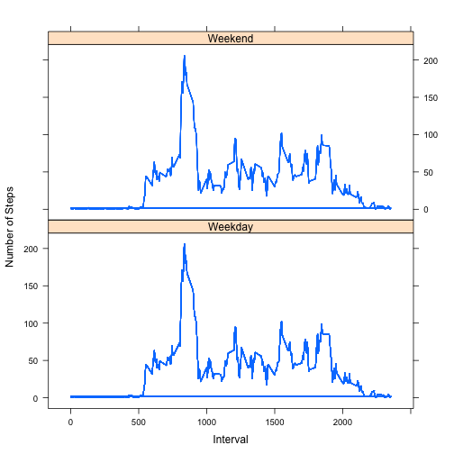

# Reproducible Research: Peer Assessment 1


## Loading and preprocessing the data


```r
data <- read.csv("activity.csv")
data_filtered <- data[!is.na(data$steps), ]
data_split <- with(data_filtered, split(steps, date))
steps_by_day <- lapply(data_split, sum)
steps_by_day <- unlist(steps_by_day)
```


## Mean total number of steps taken per day

 

```
## Mean steps per day:  9354
```

```
## Median steps per day:  10395
```


## Average daily activity pattern

 

```
## Interval with average maximum steps, average maximum steps =  835 , 206.2
```


## Inputing missing values (NAs replaced with mean of steps across intervals)


```
## Number of missing values:  2304
```


```r
# replacing missing values with mean of steps across respective interval
temp <- with(data_filtered, split(steps, interval))
temp <- lapply(temp, mean)
temp <- data.frame(interval = names(temp), steps = unlist(temp))
data[is.na(data)] <- ceiling(temp$steps)
```


 

```
## Mean steps per day (after replacing NAs):  10785
```

```
## Median steps per day (after replacing NAs):  10909
```

```
## Observation in mean/ median: mean has shifted, median has not.
```


## Differences in activity patterns between weekdays and weekends
 

